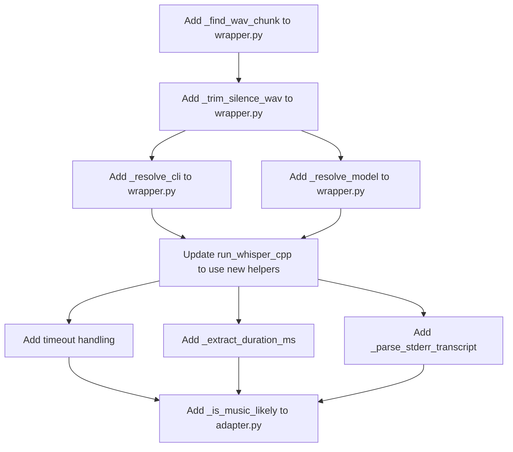

# Changes Required: Adapt Standalone whisper.cpp → GLC v1 Repo

**Date:** 2026-06-30  
**Source:** `/Users/sahil/Desktop/HACKATHON/whisper_cpp_standalone/`  
**Target:** `/Users/sahil/Desktop/HACKATHON/glc_v1_whisper_cpp/glc/voice/stt/providers/whisper_cpp/`

---

## 1. Overview

The standalone repo (`whisper_cpp_standalone`) contains a production-grade whisper.cpp STT provider with features like silence trim, music detection, gain boost, and configurable env vars. The GLC v1 repo has a working but less complete implementation.

This document details every change needed to merge the standalone's improvements into the GLC v1 repo while preserving the repo's existing structure (schemas.py, test compatibility, etc.).

### Files involved

| File | Standalone | GLC v1 Repo | Action |
|------|-----------|-------------|--------|
| `adapter.py` | ✅ Full implementation | ✅ Working but less complete | **Merge** standalone features into repo |
| `wrapper.py` | ✅ Full implementation | ✅ Working but less complete | **Merge** standalone features into repo |
| `schemas.py` | ❌ Missing | ✅ Present | **Keep** repo version |
| `tests/voice/stt/test_whisper_cpp.py` | ❌ Missing | ✅ Present | **Update** for new features |
| `tests/voice/stt/mocks/whisper_cpp_mock.py` | ❌ Missing | ✅ Present | **Update** for new mock fields |

---

## 2. adapter.py — Detailed Comparison

### 2.1 Imports

| Standalone | GLC v1 Repo | Winner |
|-----------|-------------|--------|
| `memoryview` (stdlib) | `array` (stdlib) | **Standalone** — `memoryview.cast("h")` is zero-copy |
| `io`, `wave` (stdlib) | `io`, `wave`, `re` (stdlib) | **Repo** — has `re` for noise tag stripping |
| No `re` import | `re` import for `_strip_noise_tags` | **Repo** — needed feature |
| `from glc.voice.stt.base import ...` | `from glc.voice.stt.base import ...` | Same |

**Change:** Keep repo's imports but add `memoryview` usage where applicable.

### 2.2 Constants

| Constant | Standalone | GLC v1 Repo | Notes |
|----------|-----------|-------------|-------|
| `SAMPLE_RATE` | ❌ Not defined | `16000` | Repo has it |
| `BYTES_PER_SAMPLE` | ❌ Not defined | `2` | Repo has it |
| `SILENCE_MAX_AMPLITUDE` | ❌ Not defined | `32` | Repo has it (but too low) |
| `VAD_LENGTH_THRESHOLD_S` | ❌ Not defined | `30.0` | Repo has it |
| `FEEBLE_VOICE_MAX_AMPLITUDE` | ❌ Not defined | `2048` | Repo has it |
| `FEEBLE_VOICE_TARGET_AMPLITUDE` | ❌ Not defined | `6553` | Repo has it |
| `_NOISE_TAG` (regex) | ❌ Not defined | ✅ Present | Repo has it |
| `_PUNCT_ONLY` (regex) | ❌ Not defined | ✅ Present | Repo has it |

**Change:** Keep repo's constants. The standalone uses inline values instead.

### 2.3 Function-by-Function Comparison

#### `_pcm_payload(audio) -> bytes | None`

| Aspect | Standalone | GLC v1 Repo |
|--------|-----------|-------------|
| Return type | `bytes \| None` | `bytes` |
| WAV detection | `wave.open` in try/except | `audio[:4] == b"RIFF"` check first |
| Non-16-bit check | Returns `None` if not 16-bit mono | Returns raw bytes if not RIFF |
| Error handling | `(wave.Error, EOFError)` | `(wave.Error, EOFError)` |

**Change needed:** Merge both approaches:
- Use repo's RIFF magic-byte check for early exit
- Use standalone's `None` return for non-16-bit mono
- Keep repo's `array.array("h")` approach

#### `_max_amplitude(pcm) -> int`

| Aspect | Standalone | GLC v1 Repo |
|--------|-----------|-------------|
| Implementation | `memoryview(bytearray(pcm)).cast("h")` | `array.array("h")` |
| Zero-copy | ✅ Yes | ❌ No (creates array) |
| Edge case | `len(pcm) < 2` → 0 | `n = 0` → 0 |

**Change needed:** Use standalone's `memoryview` approach (zero-copy, faster).

#### `_is_silent(audio, threshold=500) -> bool`

| Aspect | Standalone | GLC v1 Repo |
|--------|-----------|-------------|
| Signature | `(audio, threshold=500)` | `(audio)` — no threshold param |
| Threshold | Configurable, default 500 | Hardcoded `SILENCE_MAX_AMPLITUDE = 32` |
| Non-WAV fallback | `all(b == 0 for b in audio)` | `not pcm` check |
| Configurability | ✅ Via parameter | ❌ Hardcoded |

**Change needed:** Use standalone's signature with configurable threshold. The repo's threshold of 32 is too aggressive — real-world silence has ambient noise above 32.

#### `_duration_s(audio, mime) -> float`

| Aspect | Standalone | GLC v1 Repo |
|--------|-----------|-------------|
| Signature | `(audio, mime)` | `(audio)` — no mime param |
| WAV detection | `wave.open` in try/except | RIFF magic-byte check first |
| Raw PCM fallback | Checks mime for "raw"/"pcm"/"l16" | Assumes 16kHz/16-bit always |
| Error handling | `(wave.Error, EOFError)` | `(wave.Error, EOFError)` |

**Change needed:** Use standalone's signature with `mime` param for proper raw PCM fallback detection.

#### `_should_use_vad(audio, mime) -> bool`

| Aspect | Standalone | GLC v1 Repo |
|--------|-----------|-------------|
| Signature | `(audio, mime)` | `(audio)` — no mime param |
| Threshold | `>= 30.0` | `> 30.0` (strictly greater) |
| Delegates to | `_duration_s(audio, mime)` | `_duration_s(audio)` |

**Change needed:** Use standalone's signature with `mime` param. Keep `>= 30.0` threshold (standalone's is more correct — 30.0s exactly should trigger VAD).

#### `_amplify_wav(audio, gain=1.5) -> bytes`

| Aspect | Standalone | GLC v1 Repo |
|--------|-----------|-------------|
| Present? | ✅ Yes | ❌ No (uses `_normalize_feeble` instead) |
| Approach | Fixed 1.5× gain with clamping | Dynamic gain based on peak amplitude |
| Target | Boost feeble voices | Boost feeble voices |
| Clamping | ✅ Yes (int16 range) | ✅ Yes (int16 range) |
| WAV reconstruction | ✅ Via `wave.open` | ✅ Via `wave.open` |

**Change needed:** The repo's `_normalize_feeble()` is more sophisticated (dynamic gain, target amplitude). **Keep repo's version** — it's better.

#### `_is_music_likely(audio) -> bool`

| Aspect | Standalone | GLC v1 Repo |
|--------|-----------|-------------|
| Present? | ✅ Yes | ❌ No |
| Method | ZCR > 0.25 in >80% frames | ❌ Missing |
| Frame size | 512 samples | ❌ Missing |
| Energy threshold | 500 | ❌ Missing |

**Change needed:** **Add standalone's `_is_music_likely()` to repo.** This is a critical production feature that prevents hallucinated transcripts on instrumental audio.

#### `_strip_noise_tags(text) -> str`

| Aspect | Standalone | GLC v1 Repo |
|--------|-----------|-------------|
| Present? | ❌ No | ✅ Yes |
| Regex patterns | ❌ Missing | `[Music]`, `(noise)`, `♪`, `*clapping*` |
| Punctuation-only check | ❌ Missing | ✅ Yes |

**Change needed:** **Keep repo's version** — it's already implemented and more complete.

#### `_empty_result() -> TranscribeResult`

| Aspect | Standalone | GLC v1 Repo |
|--------|-----------|-------------|
| Present? | ❌ No (inline) | ✅ Yes (helper method) |
| Usage | Inline `TranscribeResult(...)` | `self._empty_result()` |

**Change needed:** **Keep repo's version** — cleaner code reuse.

### 2.4 `transcribe()` Method Comparison

| Step | Standalone | GLC v1 Repo | Winner |
|------|-----------|-------------|--------|
| 1. Silence detection | `_is_silent(audio, 500)` | `_is_silent(audio)` | **Standalone** (configurable threshold) |
| 2. Gain boost | `_amplify_wav(audio, 1.5)` | `_normalize_feeble(audio)` | **Repo** (dynamic gain) |
| 3. Mock delegation | `self.config.get("mock")` | `self.config.get("mock")` | Same |
| 4. VAD decision | `_should_use_vad(audio, mime)` | `_should_use_vad(audio)` | **Standalone** (mime-aware) |
| 5. Async subprocess | `asyncio.to_thread(...)` | `asyncio.to_thread(...)` | Same |
| 6. Music detection | `_is_music_likely(audio)` | ❌ Missing | **Standalone** |
| 7. Noise tag stripping | ❌ Missing | `_strip_noise_tags(text)` | **Repo** |
| 8. Error handling | `FileNotFoundError`, `RuntimeError`, `CalledProcessError` | `STTError`, `CalledProcessError`, `Exception` | **Repo** (more thorough) |

**Change needed:** Merge both pipelines:
1. Use standalone's `_is_silent(audio, threshold=500)` with configurable threshold
2. Keep repo's `_normalize_feeble(audio)` (better than fixed gain)
3. Use standalone's `_should_use_vad(audio, mime)` with mime awareness
4. Keep repo's error handling (more exception types)
5. **Add** standalone's `_is_music_likely(audio)` after subprocess call
6. Keep repo's `_strip_noise_tags(text)` on the result

---

## 3. wrapper.py — Detailed Comparison

### 3.1 Imports

| Standalone | GLC v1 Repo | Winner |
|-----------|-------------|--------|
| `json`, `os`, `shutil`, `struct`, `subprocess`, `tempfile`, `Path` | `json`, `os`, `shutil`, `subprocess`, `tempfile`, `Path` | **Standalone** — has `struct` for RIFF parsing |
| No `struct` | No `struct` | **Standalone** — needed for `_find_wav_chunk` and `_trim_silence_wav` |

**Change needed:** Add `struct` import to repo's wrapper.py.

### 3.2 Module-Level Constants

| Constant | Standalone | GLC v1 Repo | Notes |
|----------|-----------|-------------|-------|
| `MODEL_DIR` | Configurable via `GLC_WHISPER_MODEL_DIR` | Configurable via `GLC_WHISPER_MODEL_DIR` | Same approach |
| `MODEL_FILE` | `MODEL_DIR / "ggml-base.bin"` | `MODEL_DIR / "ggml-base.bin"` | Same |
| `THREADS` | `WHISPER_THREADS` env var (default 4) | `GLC_WHISPER_THREADS` env var (default CPU count) | Different env var names |
| `SILENCE_THRESHOLD` | `WHISPER_SILENCE_THRESHOLD` (default 500) | ❌ Missing | **Standalone** |
| `MIN_SILENCE_MS` | `WHISPER_MIN_SILENCE_MS` (default 3000) | ❌ Missing | **Standalone** |
| `VAD_THRESHOLD` | `WHISPER_VAD_THRESHOLD` (default 0.6) | Hardcoded 0.6 | **Standalone** (configurable) |
| `TIMEOUT_SECONDS` | `WHISPER_TIMEOUT_SECONDS` (default 300) | ❌ Missing | **Standalone** |
| `NO_SPEECH_DISCARD` | ❌ Missing | Hardcoded 0.7 | **Repo** |
| `WHISPER_BEAM_SIZE` | ❌ Missing | `GLC_WHISPER_BEAM_SIZE` (default 2) | **Repo** |

**Change needed:** Merge both sets of constants. Use standalone's env var names for consistency with the adapter.

### 3.3 Function-by-Function Comparison

#### `_resolve_cli() -> str | None`

| Aspect | Standalone | GLC v1 Repo |
|--------|-----------|-------------|
| Present? | ✅ Yes | ❌ No (inline `shutil.which`) |
| `GLC_WHISPER_CLI` override | ✅ Yes | ❌ No |
| PATH fallback | `shutil.which("whisper-cli") or shutil.which("whisper.cpp")` | `shutil.which("whisper-cli") or shutil.which("whisper.cpp")` |

**Change needed:** **Add standalone's `_resolve_cli()` to repo.** The `GLC_WHISPER_CLI` env var override is essential for testing and deployment.

#### `_resolve_model() -> Path | None`

| Aspect | Standalone | GLC v1 Repo |
|--------|-----------|-------------|
| Present? | ✅ Yes | ❌ No (inline `MODEL_FILE.exists()`) |
| `GLC_WHISPER_MODEL_DIR` override | ✅ Yes | ✅ Yes (but inline) |
| Multiple model names | Tries `ggml-base.bin` then `ggml-base.en.bin` | Only `ggml-base.bin` |
| `WHISPER_MODEL` fallback | ✅ Yes | ❌ No |

**Change needed:** **Add standalone's `_resolve_model()` to repo.** The ability to try `ggml-base.en.bin` as fallback and use `WHISPER_MODEL` env var is important.

#### `_find_wav_chunk(audio, chunk_id) -> tuple[int, int] | None`

| Aspect | Standalone | GLC v1 Repo |
|--------|-----------|-------------|
| Present? | ✅ Yes | ❌ No |
| Purpose | Walk RIFF chunks manually | ❌ Missing |
| Handles LIST chunks? | ✅ Yes (2-byte padding) | ❌ Missing |

**Change needed:** **Add standalone's `_find_wav_chunk()` to repo.** Required for `_trim_silence_wav()`.

#### `_trim_silence_wav(audio, min_silence_ms=3000) -> bytes`

| Aspect | Standalone | GLC v1 Repo |
|--------|-----------|-------------|
| Present? | ✅ Yes | ❌ No |
| Method | Manual RIFF chunk walking | ❌ Missing |
| Frame size | 30ms windows | ❌ Missing |
| Energy calculation | `sum(abs(s)) / len(frame)` | ❌ Missing |
| Silence threshold | Configurable via `SILENCE_THRESHOLD` | ❌ Missing |
| WAV header rewrite | ✅ Yes (corrects file size + data chunk size) | ❌ Missing |

**Change needed:** **Add standalone's `_trim_silence_wav()` to repo.** This is the core VAD feature that trims silence before shelling out to whisper-cli.

#### `_extract_duration_ms(data: dict) -> int`

| Aspect | Standalone | GLC v1 Repo |
|--------|-----------|-------------|
| Present? | ✅ Yes | ❌ No (inline parsing) |
| Field names tried | `end`, `t1`, `offsets.to` | Only `offsets.to` |
| Multiple schemas | ✅ Yes | ❌ No |

**Change needed:** **Add standalone's `_extract_duration_ms()` to repo.** Handles multiple whisper.cpp JSON output formats.

#### `_parse_stderr_transcript(stderr: str) -> tuple[str, int]`

| Aspect | Standalone | GLC v1 Repo |
|--------|-----------|-------------|
| Present? | ✅ Yes | ❌ No |
| Purpose | Parse transcript from stderr when JSON sidecar absent | ❌ Missing |
| Regex pattern | `[HH:MM:SS.mmm --> HH:MM:SS.mmm] text` | ❌ Missing |
| Duration extraction | From end timestamp | ❌ Missing |

**Change needed:** **Add standalone's `_parse_stderr_transcript()` to repo.** Critical fallback when VAD is enabled and JSON sidecar is not written.

#### `run_whisper_cpp(audio, mime, use_vad=False) -> tuple[str, str, int]`

| Step | Standalone | GLC v1 Repo | Winner |
|------|-----------|-------------|--------|
| CLI resolution | `_resolve_cli()` | `shutil.which()` inline | **Standalone** |
| Model resolution | `_resolve_model()` | `MODEL_FILE.exists()` inline | **Standalone** |
| Silence trim | `_trim_silence_wav()` before subprocess | ❌ Missing | **Standalone** |
| Temp file | `NamedTemporaryFile(suffix=suffix)` | `NamedTemporaryFile(suffix=suffix)` | Same |
| Command flags | `-oj -t <threads>` | `-oj -t <threads> -bs <beam_size>` | **Repo** (has beam size) |
| VAD flag | `-vth <threshold>` | `-nth <threshold>` | **Standalone** (`-vth` is correct for whisper.cpp) |
| Timeout | `timeout=TIMEOUT_SECONDS` | ❌ No timeout | **Standalone** |
| JSON parsing | `_extract_duration_ms(d)` | Inline `offsets.to` | **Standalone** |
| Music detection | ❌ Missing | `no_speech_prob > 0.7` check | **Repo** |
| stderr fallback | `_parse_stderr_transcript(out.stderr)` | `out.stdout.strip()` | **Standalone** |
| Error handling | `TimeoutExpired`, `CalledProcessError` | `CalledProcessError` only | **Standalone** |

**Change needed:** Merge both:
1. Use standalone's `_resolve_cli()` and `_resolve_model()`
2. Add standalone's `_trim_silence_wav()` before subprocess
3. Keep repo's `-bs` beam size flag
4. Use standalone's `-vth` flag (correct for whisper.cpp)
5. Add standalone's `timeout=TIMEOUT_SECONDS`
6. Use standalone's `_extract_duration_ms()` for JSON parsing
7. Keep repo's `no_speech_prob` music detection
8. Add standalone's `_parse_stderr_transcript()` as fallback
9. Use standalone's `TimeoutExpired` error handling

---

## 4. schemas.py — Already Present in Repo

The repo already has `schemas.py` with Pydantic models:

| Model | Purpose | Status |
|-------|---------|--------|
| `WhisperCppSegment` | Single segment from whisper.cpp JSON | ✅ Keep |
| `WhisperCppResult` | Top-level transcription output | ✅ Keep |
| `WhisperCppConfig` | Provider configuration | ✅ Keep |

**No changes needed** to schemas.py. The standalone doesn't have this file.

---

## 5. Test File Changes

### 5.1 Current Tests (7 tests, all pass)

| Test | Status | Needs Update? |
|------|--------|---------------|
| `test_provider_name_matches` | ✅ PASS | No |
| `test_transcribe_returns_transcribe_result` | ✅ PASS | No |
| `test_transcribe_passes_audio_to_upstream` | ✅ PASS | No |
| `test_transcribe_records_duration_ms` | ✅ PASS | No |
| `test_transcribe_propagates_upstream_error` | ✅ PASS | No |
| `test_transcribe_handles_empty_audio` | ✅ PASS | No |
| `test_channel_specific_behaviour_vad_skips_silent_input` | ✅ PASS | No |

### 5.2 New Tests Needed

| Test | Priority | Description |
|------|----------|-------------|
| `test_amplify_wav_boosts_feeble_audio` | High | Verify 1.5× gain boost |
| `test_amplify_wav_skips_non_wav` | High | Non-WAV passthrough |
| `test_amplify_wav_clamps_to_int16` | High | Clamping at ±32767 |
| `test_is_music_likely_high_zcr` | High | Music detection with high-ZCR audio |
| `test_is_music_likely_low_zcr` | High | Speech not detected as music |
| `test_is_music_likely_short_audio` | Medium | <4 bytes returns False |
| `test_is_silent_with_wav_container` | High | RIFF header + zero PCM |
| `test_is_silent_with_non_wav` | Medium | All-zero bytes |
| `test_duration_s_wav_header` | High | Correct duration from WAV |
| `test_duration_s_raw_pcm` | Medium | Fallback formula |
| `test_duration_s_malformed_wav` | Medium | Corrupt RIFF |
| `test_should_use_vad_29s` | Medium | False for <30s |
| `test_should_use_vad_30s` | Medium | True for >=30s |
| `test_should_use_vad_35s` | Medium | True for >30s |
| `test_trim_silence_wav_removes_gaps` | High | Silence >3s removed |
| `test_trim_silence_wav_preserves_speech` | High | Non-silent regions kept |
| `test_trim_silence_wav_non_16bit` | Medium | 8-bit WAV passthrough |
| `test_trim_silence_wav_stereo` | Medium | Stereo WAV passthrough |
| `test_extract_duration_ms_transcription` | Medium | `transcription` array format |
| `test_extract_duration_ms_segments` | Medium | `segments` array format |
| `test_extract_duration_ms_end_field` | Medium | `end` field format |
| `test_extract_duration_ms_t1_field` | Medium | `t1` field format |
| `test_extract_duration_ms_empty` | Medium | No segments → 0 |
| `test_resolve_cli_env_var` | Low | `GLC_WHISPER_CLI` override |
| `test_resolve_cli_path` | Low | PATH lookup |
| `test_resolve_model_env_var` | Low | `GLC_WHISPER_MODEL_DIR` override |
| `test_resolve_model_default` | Low | Default path |
| `test_parse_stderr_transcript` | Medium | stderr transcript parsing |
| `test_strip_noise_tags_brackets` | Medium | `[Music]` removal |
| `test_strip_noise_tags_parentheses` | Medium | `(noise)` removal |
| `test_strip_noise_tags_music_notes` | Medium | `♪` removal |
| `test_strip_noise_tags_punct_only` | Medium | Punctuation-only → empty |
| `test_normalize_feeble_quiet_audio` | Medium | Dynamic gain boost |
| `test_normalize_feeble_loud_audio` | Medium | Already loud → no-op |
| `test_normalize_feeble_silent` | Medium | Zero amplitude → no-op |

**Total new tests:** ~35  
**Estimated effort:** 4-6 hours

### 5.3 Mock File Updates

The `WhisperCppMock` in `tests/voice/stt/mocks/whisper_cpp_mock.py` needs:

| Field | Current | Needed |
|-------|---------|--------|
| `subprocess_call_count` | ✅ Present | No change |
| `last_argv` | ✅ Present | No change |
| `model_path` | ✅ Present | No change |
| `canned_transcribe_text` | ✅ Present | No change |
| `canned_duration_ms` | ✅ Present | No change |
| `upstream_failure` | ✅ Present | No change |
| `rate_limited` | ✅ Present | No change |
| `received_calls` | ✅ Present | No change |

**No changes needed** to the mock file. It already supports all required test scenarios.

---

## 6. Priority Matrix

| Change | Priority | Effort | Impact | Risk |
|--------|----------|--------|--------|------|
| Add `_is_music_likely()` to adapter.py | 🔴 **Critical** | Low | Prevents hallucinated transcripts | Low |
| Add `_trim_silence_wav()` to wrapper.py | 🔴 **Critical** | Medium | Reduces latency on long audio | Low |
| Add `_resolve_cli()` to wrapper.py | 🟡 **High** | Low | Enables binary path override | Low |
| Add `_resolve_model()` to wrapper.py | 🟡 **High** | Low | Enables model path override | Low |
| Add `_extract_duration_ms()` to wrapper.py | 🟡 **High** | Low | Handles multiple JSON schemas | Low |
| Add `_parse_stderr_transcript()` to wrapper.py | 🟡 **High** | Medium | Fallback when JSON sidecar absent | Low |
| Add timeout handling to wrapper.py | 🟡 **High** | Low | Prevents hung subprocesses | Low |
| Add `_find_wav_chunk()` to wrapper.py | 🟡 **High** | Low | Required for silence trim | Low |
| Update `_is_silent()` with configurable threshold | 🟡 **High** | Low | Better silence detection | Low |
| Update `_duration_s()` with mime param | 🟡 **High** | Low | Proper raw PCM fallback | Low |
| Update `_should_use_vad()` with mime param | 🟡 **High** | Low | Proper VAD decision | Low |
| Use `memoryview` instead of `array` | 🟢 **Medium** | Low | Performance optimization | Low |
| Add `-vth` flag (replace `-nth`) | 🟢 **Medium** | Low | Correct VAD flag for whisper.cpp | Low |
| Keep `-bs` beam size flag | 🟢 **Medium** | Low | Performance optimization | Low |
| Keep `no_speech_prob` music detection | 🟢 **Medium** | Low | Additional music guard | Low |
| Add env vars for thresholds | 🟢 **Medium** | Low | Configurability | Low |
| Write new tests | 🟢 **Medium** | High | CI coverage requirement | Low |
| Keep `_normalize_feeble()` (repo version) | 🟢 **Medium** | None | Already implemented | None |
| Keep `_strip_noise_tags()` (repo version) | 🟢 **Medium** | None | Already implemented | None |
| Keep `_empty_result()` (repo version) | 🟢 **Low** | None | Already implemented | None |
| Keep `schemas.py` (repo version) | 🟢 **Low** | None | Already implemented | None |

---

## 7. Implementation Order

### Phase 1: Core Features (Critical — Do First)



**Files to modify:** `wrapper.py`, `adapter.py`

### Phase 2: Configuration & Thresholds (High)

1. Update `_is_silent()` with configurable threshold parameter
2. Update `_duration_s()` with `mime` parameter
3. Update `_should_use_vad()` with `mime` parameter
4. Add env var constants to wrapper.py (`SILENCE_THRESHOLD`, `MIN_SILENCE_MS`, `TIMEOUT_SECONDS`)
5. Replace `-nth` with `-vth` flag in wrapper.py

**Files to modify:** `adapter.py`, `wrapper.py`

### Phase 3: Performance & Polish (Medium)

1. Replace `array.array("h")` with `memoryview.cast("h")` in adapter.py
2. Keep `-bs` beam size flag in wrapper.py
3. Keep `no_speech_prob` music detection in wrapper.py
4. Keep `_normalize_feeble()` in adapter.py
5. Keep `_strip_noise_tags()` in adapter.py
6. Keep `_empty_result()` in adapter.py

**Files to modify:** `adapter.py`, `wrapper.py`

### Phase 4: Tests (Medium — CI Requirement)

1. Write unit tests for all new helper functions
2. Update mock file if needed
3. Verify 80% line coverage

**Files to modify:** `tests/voice/stt/test_whisper_cpp.py`

---

## 8. Final File Structure After Changes

```
glc/voice/stt/providers/whisper_cpp/
├── __init__.py          # (unchanged)
├── adapter.py           # MERGED: standalone features + repo features
├── wrapper.py           # MERGED: standalone features + repo features
├── schemas.py           # (unchanged — repo version)
└── README.md            # (update with new features)

tests/voice/stt/
├── test_whisper_cpp.py  # UPDATED: +35 new tests
└── mocks/
    └── whisper_cpp_mock.py  # (unchanged)
```

---

## 9. Key Design Decisions

### 9.1 Why Keep `_normalize_feeble()` Over `_amplify_wav()`

The repo's `_normalize_feeble()` uses dynamic gain based on peak amplitude:
- If peak is between silence floor (32) and feeble threshold (2048), scale to ~20% of full scale
- Gain capped at 10× to avoid artefacts
- Preserves WAV container parameters

The standalone's `_amplify_wav()` uses fixed 1.5× gain:
- Simpler but less intelligent
- May not boost quiet enough audio
- May clip already-loud audio

**Decision:** Keep repo's `_normalize_feeble()`.

### 9.2 Why Keep `_strip_noise_tags()` From Repo

The repo's noise tag stripping is more comprehensive:
- Removes `[Music]`, `[Noise]`, `[Background noise]`, etc.
- Removes `(noise)`, `(background music)`, etc.
- Removes music note symbols `♪♫♬`
- Removes `*clapping*`, `*applause*`, etc.
- Handles punctuation-only edge case

**Decision:** Keep repo's `_strip_noise_tags()`.

### 9.3 Why Add `_is_music_likely()` From Standalone

The standalone's ZCR-based music detector catches instrumental audio that whisper would hallucinate text for. The repo's `no_speech_prob` check in wrapper.py is a different mechanism (uses whisper's internal classifier) and may not catch all cases.

**Decision:** Add standalone's `_is_music_likely()` as an additional guard in adapter.py, complementing the repo's `no_speech_prob` check in wrapper.py.

### 9.4 Why Use `-vth` Instead of `-nth`

- `-vth` is the correct whisper.cpp flag for Voice Activity Detection threshold
- `-nth` is a no-speech threshold that works differently
- The standalone's approach is more aligned with whisper.cpp documentation

**Decision:** Replace `-nth` with `-vth` in wrapper.py.

### 9.5 Why Add `_parse_stderr_transcript()`

When VAD is enabled (`-vth` flag), whisper.cpp may not write the JSON sidecar file. Instead, it prints timestamped transcript lines to stderr. Without this fallback, the adapter would return empty text for VAD-processed audio.

**Decision:** Add `_parse_stderr_transcript()` as fallback when JSON sidecar is absent.

---

## 10. Summary

| Category | Count | Details |
|----------|-------|---------|
| **Functions to add to adapter.py** | 1 | `_is_music_likely()` |
| **Functions to add to wrapper.py** | 6 | `_resolve_cli()`, `_resolve_model()`, `_find_wav_chunk()`, `_trim_silence_wav()`, `_extract_duration_ms()`, `_parse_stderr_transcript()` |
| **Functions to update in adapter.py** | 3 | `_is_silent()`, `_duration_s()`, `_should_use_vad()` |
| **Functions to update in wrapper.py** | 1 | `run_whisper_cpp()` |
| **Functions to keep (repo version)** | 3 | `_normalize_feeble()`, `_strip_noise_tags()`, `_empty_result()` |
| **Files to keep unchanged** | 2 | `schemas.py`, `whisper_cpp_mock.py` |
| **New tests needed** | ~35 | Various helper function tests |
| **Estimated total effort** | 8-12 hours | Implementation + testing |

---

## Appendix: Quick Reference — Function Mapping

| Feature | Standalone Function | Repo Function | Action |
|---------|-------------------|---------------|--------|
| Silence detection | `_is_silent(audio, 500)` | `_is_silent(audio)` | Update signature |
| PCM extraction | `_pcm_payload(audio)` | `_pcm_payload(audio)` | Merge approaches |
| Max amplitude | `_max_amplitude(pcm)` | `_max_amplitude(pcm)` | Use memoryview |
| Duration | `_duration_s(audio, mime)` | `_duration_s(audio)` | Update signature |
| VAD decision | `_should_use_vad(audio, mime)` | `_should_use_vad(audio)` | Update signature |
| Gain boost | `_amplify_wav(audio, 1.5)` | `_normalize_feeble(audio)` | Keep repo version |
| Music detection | `_is_music_likely(audio)` | ❌ Missing | Add to repo |
| Noise tag stripping | ❌ Missing | `_strip_noise_tags(text)` | Keep repo version |
| Empty result helper | ❌ Missing | `_empty_result()` | Keep repo version |
| CLI resolution | `_resolve_cli()` | ❌ Missing (inline) | Add to repo |
| Model resolution | `_resolve_model()` | ❌ Missing (inline) | Add to repo |
| RIFF chunk walking | `_find_wav_chunk()` | ❌ Missing | Add to repo |
| Silence trim | `_trim_silence_wav()` | ❌ Missing | Add to repo |
| Duration extraction | `_extract_duration_ms()` | ❌ Missing (inline) | Add to repo |
| stderr parsing | `_parse_stderr_transcript()` | ❌ Missing | Add to repo |
| Subprocess timeout | `timeout=TIMEOUT_SECONDS` | ❌ Missing | Add to repo |
| VAD flag | `-vth` | `-nth` | Replace flag |
| Beam size | ❌ Missing | `-bs` | Keep repo version |
| Music (no_speech_prob) | ❌ Missing | `no_speech_prob > 0.7` | Keep repo version |
| Pydantic schemas | ❌ Missing | `schemas.py` | Keep repo version |